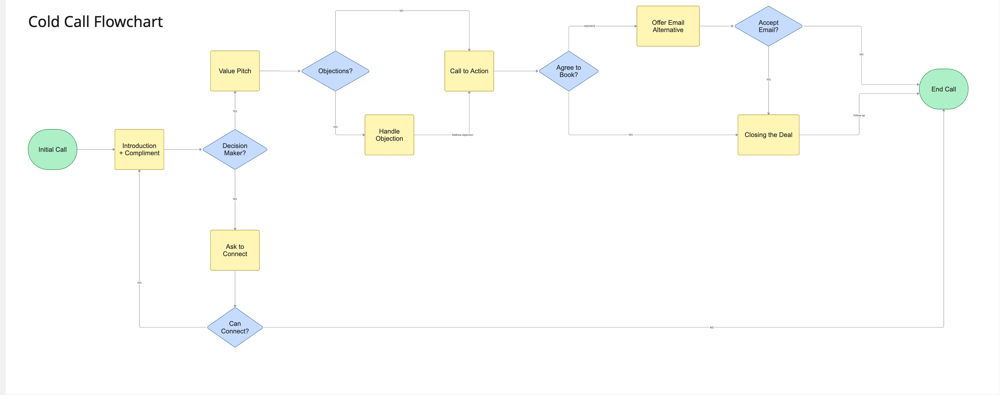
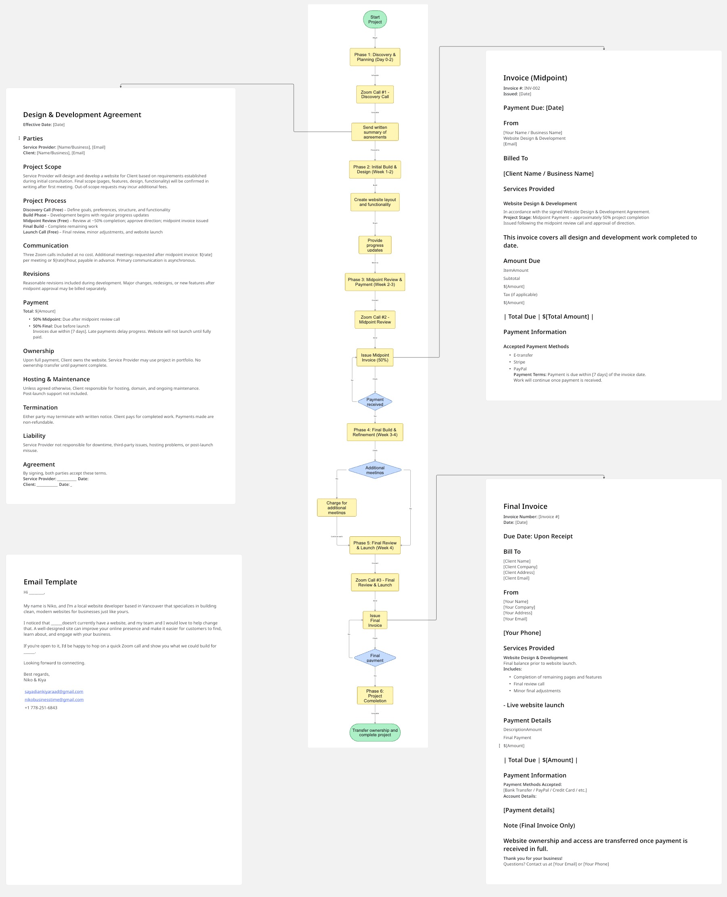

# B2B Client Lifecycle & Operations Framework
### 🎓 Senior Capstone Project (2024 – 2026)

**Author:** Niko Virdi  
**Institution:** Moscrop Secondary School  
**Project Type:** Self-Directed Graduation Capstone / Operational Systems Design  

---

## 📌 Project Executive Summary
This repository showcases the comprehensive, multi-year Capstone project I designed to scale a B2B (Business-to-Business) digital service agency. Over a two-year development cycle, I researched, engineered, and mapped out an entire operational pipeline—moving systematically from raw cold market outreach straight through to structured project delivery, milestone financial gates, and final digital asset deployment.

The core objective was to take an unstructured service model and turn it into a repeatable, highly efficient corporate workflow that eliminates scope creep and optimizes client acquisition.

---

## 🛠️ Operational Architecture & Process Maps

### 1. Lead Generation & Cold Outreach Pipeline
* **Objective:** Maximize conversion rates and optimize outbound front-end sales efficiency in highly saturated digital markets.
* **Mechanism:** A logical, conditional process map that structures the initial value pitch, navigates gatekeepers, handles standard business objections dynamically, and establishes alternative email nurturing tracks for cold leads.

---

### 2. Project Delivery & Engagement Framework
* **Objective:** Standardize client fulfillment, mitigate project delays, and secure consistent corporate cash flow checkpoints.
* **Phases Mapped:** * **Phases 1–2 (Discovery & Initial Build):** Client onboarding, alignment meetings, and baseline wireframe/layout engineering.
  * **Phase 3 (Midpoint Review & Billing Gate):** Strategic milestone review gated by a mandatory 50% invoice payment protocol before progressing.
  * **Phases 4–5 (Refinement & Deployment):** Feedback revision loops, final contract billing execution, and the formal transfer of digital asset ownership.

---

## 📄 Core Framework Artifacts Included
Integrated directly into this visual lifecycle are standardized corporate templates designed to protect operational capacity:
* **Data-Driven Cold Scripts:** Structured conditional logic paths for live B2B calls.
* **Master Service Agreements (MSA):** Strict legal definitions covering project scope, maximum revision limits, and liability clauses.
* **Milestone Invoicing System:** Financial checkpoints structurally tied to concrete project deliverables rather than arbitrary calendar dates.

---

## 🚀 Future Roadmap: AI & Automation Integration

To scale this operational framework and eliminate manual bottlenecks, the next phase of development focuses on building a fully automated, AI-driven pipeline using enterprise-grade automation tools:

### 1. Automated Outbound Sales Pipeline (n8n + Claude AI)
* **Workflow Automation:** Deploy **n8n** to orchestrate real-time lead scrapers and feed target company data directly into data enrichment pipelines.
* **Intelligent Outbound:** Integrate **Claude AI** via API to dynamically analyze a target company's current digital presence, auto-generate deeply personalized cold outreach scripts, and trigger automated AI-voice calling systems.

### 2. Autonomous Service Delivery & Web Development
* **Instant Asset Creation:** Build an automated trigger where a successfully converted lead instantly prompts **Claude** to generate bespoke front-end website code based on the client's discovery data.
* **Zero-Touch Onboarding:** Link the system so that as soon as a contract is signed, the development environment initializes automatically, drastically reducing the time between initial contact and project launch.
